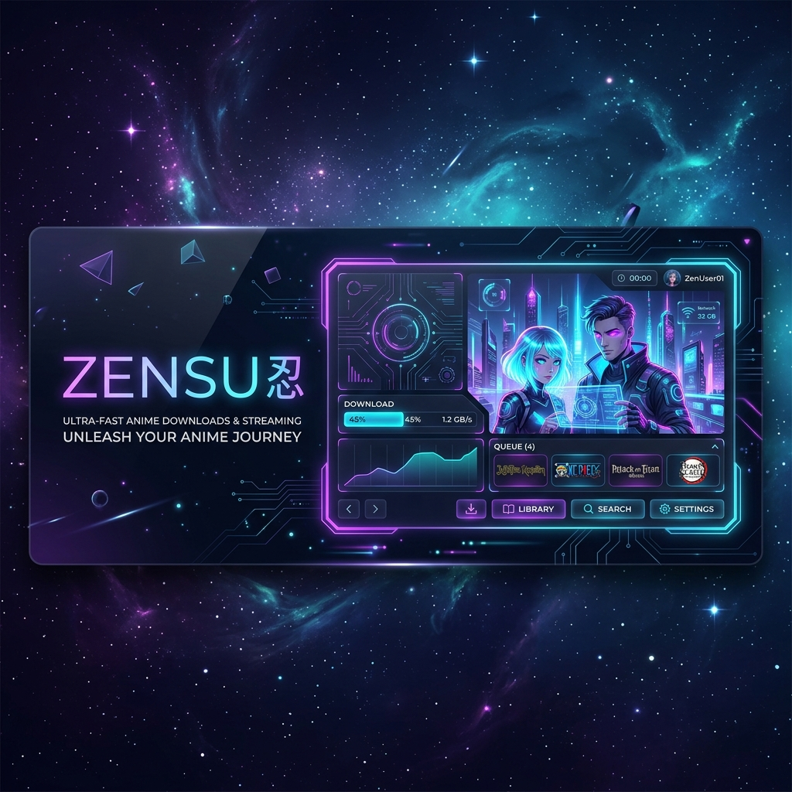
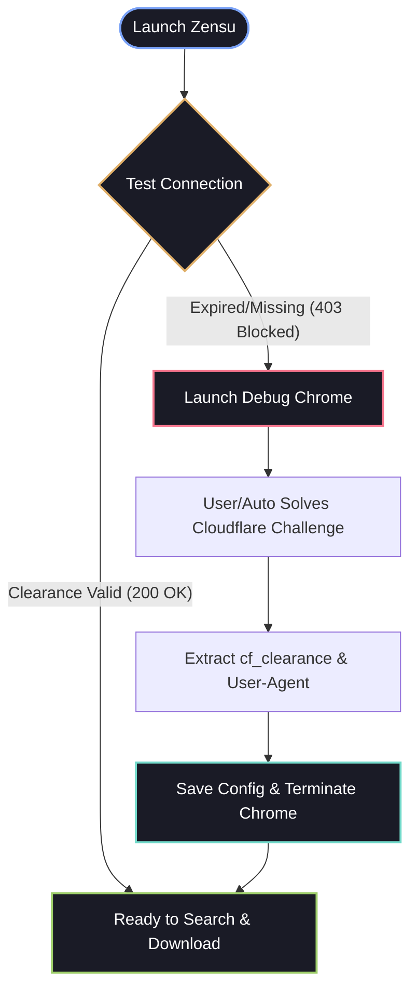

<p align="center">
  
</p>

<p align="center">
  
  
  
  
</p>

<h1 align="center">
  <br>
  Zensu
</h1>
<p align="center"><b>A premium, glassmorphic dark-themed downloader for AnimePahe.</b><br>
Features native TLS fingerprinting, automated Cloudflare solver, and modular multi-platform runtimes (Desktop GUI + CLI).
</p>

---

## ⚡ Highlights

<table width="100%">
  <tr>
    <td width="50%" valign="top">
      <h3>🚀 Pure Speed & Power</h3>
      <ul>
        <li><b>Concurrent Downloads:</b> Segmented parallel streams for maximum network utilization.</li>
        <li><b>TLS Fingerprinting:</b> Client hello simulation to slip past bot blockers undetected.</li>
        <li><b>HLS Resiliency:</b> Automatic recovery and dynamic fragment concatenation.</li>
      </ul>
    </td>
    <td width="50%" valign="top">
      <h3>🧠 Self-Healing System</h3>
      <ul>
        <li><b>Chrome CDP Solver:</b> Automated launch of debug browser to harvest clearance tokens.</li>
        <li><b>Auto-FFmpeg Resolver:</b> Downloads and hooks architecture-specific binaries on-the-fly.</li>
        <li><b>Zero Node.js dependency:</b> Native Go Edwards Deobfuscator executes JavaScript packers.</li>
      </ul>
    </td>
  </tr>
</table>

---

## 🌀 Automatic Clearance Workflow

Zensu operates with a smart **self-healing authentication loop**. It checks connection health silently on startup, resolving clearance issues *only* when necessary:



---

## 🛠️ Build & Installation

Get Zensu running on your machine with a few terminal commands:

> [!NOTE]
> Ensure you have Go v1.22+ and Node.js installed to build from source.

### 1. Initialize Environment
Choose the setup script matching your operating system:
* **Windows (PowerShell)**: 
  ```powershell
  .\setup.ps1
  ```
* **Linux / Termux / macOS (Shell)**: 
  ```bash
  chmod +x setup.sh && ./setup.sh
  ```

### 2. Compile Targets
* **Windows (PowerShell)**: 
  ```powershell
  $env:PATH = "C:\Program Files\Go\bin;" + $env:PATH; .\build.ps1
  ```
* **Linux / macOS (Shell)**: 
  ```bash
  ./build.sh
  ```

All compiled binaries will be built into the `build/` directory.

---

## 🎮 Interface Modes

### 🪐 Desktop GUI
Launch the visual binary: `.\build\bin\zensu.exe`
- **Zero-Click Bypass:** Verifies cookies on startup, opening Chrome in the background only if clearance expired.
- **Glassmorphic UI:** A dark, visually pleasing user interface styled for fluid animations.
- **Interactive Directory Picker:** Scan local directories for existing episodes dynamically.

### 💻 Command-Line Interface (CLI)
For lightweight or remote terminal environments (including Termux/SSH):
* **Windows**: `build\bin\cli\zensu-cli.exe`
* **Linux**: `./build/bin/cli/zensu-cli`
* **Android/Termux**: `./build/bin/cli/zensu-termux`

---

## ⚙️ App Configurations

Your preferences are managed automatically in OS-native app data directories:
* **Windows path:** `%APPDATA%\zensu\config.json`
* **Linux/Android path:** `~/.config/zensu/config.json`

```json
{
  "ua": "Mozilla/5.0 (Windows NT 10.0; Win64; x64) AppleWebKit/537.36...",
  "cf": "your_cf_clearance_token",
  "downloadDir": "C:\\Users\\User\\Videos\\Anime",
  "maxParallel": 3,
  "quality": "1080",
  "audio": "jpn",
  "domain": "https://animepahe.pw"
}
```

---

## 📂 Developer Bypass Fallbacks

If automatic Chrome CDP extraction is not preferred, Zensu offers two alternative manual clearance flows:

<details>
<summary><b>Option A: Chrome Extension (Click to Expand)</b></summary>
<br>

1. Open Chrome and navigate to `chrome://extensions/`.
2. Enable **Developer mode** toggle (top-right).
3. Click **Load unpacked** and select the `extension/` directory.
4. Visit `https://animepahe.pw`, open the Zensu extension popup, and copy the cookie payloads.
</details>

<details>
<summary><b>Option B: Manual Header Copy (Click to Expand)</b></summary>
<br>

1. Navigate to your mirror domain, press `F12` for DevTools.
2. Select the **Network** tab and reload the page.
3. Select any document request, and copy the `cookie:` header string, `cf_clearance` value, and `User-Agent`.
4. Paste them directly into the GUI settings panel or your `config.json` file.
</details>
